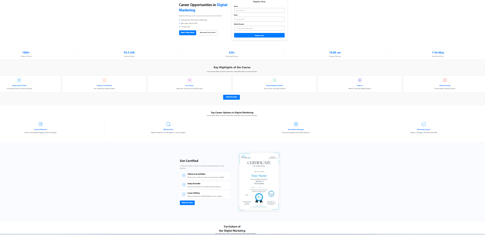

# Figma Webpage

A responsive and modern website converted from a Figma design using HTML, CSS and JavaScript.

## 🚀 Features
- Responsive Design
- Modern User Interface
- Clean Layout
- Mobile Friendly
- Smooth User Experience

## 🛠️ Technologies Used
- HTML5
- CSS3
- JavaScript

## 📂 Project Structure
- index.html
- style.css
- script.js
- images/

## 📸 Screenshot

## 🌐 Live Demo
https://rohitsahu-developer.github.io/Figma-Webpage/

## 👨‍💻 Author
Rohit Sahu
